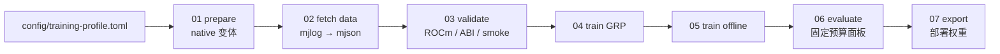

<div align="center">

# MahjongAI-Sanma-Training

[](https://github.com/Gandhara2077/MahjongAI-Sanma-Training/actions/workflows/ci.yml)
[](https://www.python.org/downloads/)
[](https://rocm.docs.amd.com/projects/radeon-ryzen/en/latest/docs/install/installrad/windows/install-pytorch.html)
[](https://rocm.docs.amd.com/projects/radeon-ryzen/en/latest/docs/compatibility/compatibilityrad/windows/windows_compatibility.html)
[](docs/USAGE.md)
[](LICENSE)
[](https://github.com/Equim-chan/Mortal)

**三人麻将（三麻 / sanma）AI 训练工程** —— 在 [Mortal](https://github.com/Equim-chan/Mortal) 之上补齐三麻规则、
观测编码、牌谱数据管线、离线/在线训练与统计化评测。

[简体中文](README.md) · [English](docs/README.en.md) · [日本語](docs/README.ja.md)

</div>

---

## 这是什么

本仓库是一套**可复现的三人日本麻将 AI 训练工作流**，不是一个 `pip install` 即可用的 Python 包。
它把从「下载天凤牌谱」到「导出可部署权重」的完整链路脚本化，并把每一步的输入、输出与校验
都固定在配置文件和检查脚本里。

上游 Mortal 面向四人麻将（yonma）。本项目的主要增量是：

| 能力 | 说明 |
| --- | --- |
| 三麻规则与编码 | 三麻 native 扩展（抜きドラ、三人局流程）与 `775×34` 观测 / 44 动作空间 |
| 变体切换 | 用 `config/training-profile.toml` 的 `variant` 在 `sanma` 与 `yonma` 之间切换，脚本自动解析训练/自动化配置与数据目录 |
| 数据管线 | 下载天凤原始 `.mjlog` → 转换为 gzip JSON Lines `.mjson` → 生成带校验的 manifest |
| GRP 训练 | 先训练顺位点预测器（GRP），再训练主模型，并用冻结的 GRP 为在线自对弈样本提供稠密奖励 |
| 统计化评测 | 三方（`one_vs_two` / `one_vs_three`）对局、阶梯式固定预算面板、95% 置信区间与配对检验 |
| 失败即停 | 环境不满足（ROCm 不可用、资产缺失、ABI 不匹配）时脚本报错退出，不静默降级到 CPU |

> **先说清楚边界**：native 在线自对弈路径是实验功能。它的吞吐、续跑、内部 smoke 或自对弈结果
> 不等于兼容 reference evaluator 的评测结果，也不能证明棋力提升、晋级或部署安全。本仓库不声明
> 任何「冠军」结论。

## 目录结构

```
MahjongAI-Sanma-Training/
├── config/training-profile.toml   # 唯一的活动变体入口（sanma / yonma）
├── scripts/                       # 01–07 一键阶段脚本 + profile 解析
├── checks/                        # 可重复检查：ABI / 数据 / 在线 / 性能 / 统计
├── artifacts/sanma-assets.json    # 外部权重与 reference 的大小 + SHA-256 manifest
├── baselines/README.md            # 本地应保留的权重清单（权重本身不入库）
├── docs/                          # USAGE / spec / ADR / 多语言 README
├── reports/                       # 历史实验记录（含负结果）
├── koromo/                        # 牌谱下载与转换脚本（数据本体不入库）
├── Mortal/                        # 上游 Mortal 的修改副本（Rust + Python，AGPL-3.0）
└── requirements.txt               # 非 PyTorch 的运行时依赖
```

`Mortal/` 是上游仓库的 vendored 修改副本，保留其自身的 `LICENSE` 与版权声明；其余目录为本项目的
编排层。详见 [`NOTICE.md`](NOTICE.md)。

## 环境要求

| 项目 | 要求 |
| --- | --- |
| 操作系统 | 64 位 Windows，PowerShell 5.1 或 PowerShell 7 |
| Python | **CPython 3.12**（脚本会拒绝其他小版本） |
| GPU | 受支持的 AMD GPU + ROCm 运行时；脚本使用 `cuda:0`，ROCm 通过 `torch.cuda` API 暴露 |
| PyTorch | 与 GPU / Windows / Python 匹配的 AMD ROCm wheel |
| Rust | stable / MSVC 工具链与 Cargo（无可复用 `.pyd` 时需要 C++ 构建工具） |

> **不要**执行裸 `pip install torch`，也不要使用 CUDA 的 PyTorch index —— 那样无法证明本项目
> 获得了 AMD ROCm 支持。GPU 不可用时一键流程会失败，不会静默改用 CPU。

## 快速开始

完整的环境、wheel、外部资产、profile、阶段脚本、检查与回滚说明见 [`docs/USAGE.md`](docs/USAGE.md)。
最短路径：

```powershell
git clone https://github.com/Gandhara2077/MahjongAI-Sanma-Training.git
cd MahjongAI-Sanma-Training

conda env create -f Mortal/environment.yml
conda activate mortal
python -m pip install -r requirements.txt
# 按 docs/USAGE.md 从 AMD 官方页面安装与你 GPU 匹配的 ROCm torch wheel

# 不下载、不训练、也不需要外部权重，先看流程预览
powershell.exe -NoProfile -ExecutionPolicy Bypass -File .\scripts\run_all.ps1 -DryRun -SkipData

# 再放置外部 sanma 权重与 libriichi3p reference（见 docs/USAGE.md 第 3 节）
```

## 流水线

从仓库根目录按顺序执行；也可用 `.\scripts\run_all.ps1` 串联：

| 阶段 | 脚本 | 作用 |
| --- | --- | --- |
| 01 | `01_prepare.ps1` | 编译并激活当前变体的 native 扩展 |
| 02 | `02_fetch_data.ps1` | 下载、转换并校验天凤牌谱 |
| 03 | `03_validate.ps1` | ROCm、profile、资产、ABI 与 bounded smoke |
| 04 | `04_train_grp.ps1` | 训练 GRP 状态（顺位点预测器） |
| 05 | `05_train_offline.ps1` | 离线训练主模型 |
| 06 | `06_evaluate.ps1` | 评测：三麻 `one_vs_two`，四麻 `one_vs_three` |
| 07 | `07_export.ps1` | 从完整训练状态导出部署格式权重 |

已有 native 与数据时可从中间阶段恢复：

```powershell
.\scripts\run_all.ps1 -FromStep validate -SkipPrepare -SkipData
```



## 变体切换

只需修改 `config/training-profile.toml`：

```toml
[active]
variant = 'sanma' # 或 'yonma'
```

- `sanma`：3 人，使用 `Mortal/config/sanma-training.toml`、数据目录 `koromo/`，默认模型
  `baselines/sanma_baseline_mortal3p_original.pth`；
- `yonma`：4 人，使用 `Mortal/config/yonma.toml`、数据目录 `koromo4p/`，默认模型
  `baselines/baseline.pth`。

`Mortal/mortal/libriichi.pyd` 是**单一活动 native 槽位**：切换变体后必须重新运行 `01_prepare.ps1`，
同一工作树中不能同时激活两个变体。

## 数据集与产物

训练数据**不随仓库发布**。`02_fetch_data.ps1` 按 profile 下载天凤原始 `.mjlog`，转换为 `.mjson`，
并在 `data/manifests/` 生成校验清单。数据源入口为 [Tenhou official logs](https://tenhou.net/sc/raw/)，
使用前请遵守其条款；不要把同一局牌谱拆进训练集和验证集。

以下均为本地生成物或外部输入，被 `.gitignore` 排除，不随 Git 分发：

- `baselines/*.pth` —— 初始化权重、基线、冻结 GRP；
- `Mortal/training/` —— 训练状态、部署权重、GRP 状态、索引、TensorBoard 日志、match records；
- `koromo/{mjlog,mjson}` —— 牌谱数据；
- `.cache/libriichi3p/*.pyd` —— 外部 reference 扩展。

缺失时按 `04 → 05 → 06 → 07` 的顺序重建。`artifacts/sanma-assets.json` 只记录外部资产的大小、
SHA-256 与 ABI（版本 4、观测 `775×34`、动作空间 44），不含二进制本身。

## 检查与 CI

不需要 GPU、也不需要外部权重即可运行的检查（CI 同样执行前三项）：

```powershell
python checks/abi/training_profile_check.py --generic
python checks/abi/one_click_dry_run_check.py
git diff --check
```

CI（[`.github/workflows/ci.yml`](.github/workflows/ci.yml)）在每次推送与 PR 时执行上述两项契约检查、
自有 Python 代码的字节编译，以及 ruff 错误级规则扫描（`Mortal/` 作为 vendored 上游树被排除）。
它**不**验证 GPU 训练或棋力。

## 文档

| 文档 | 内容 |
| --- | --- |
| [`docs/USAGE.md`](docs/USAGE.md) | 环境、安装、外部资产、阶段脚本、输出与回滚（**必读**） |
| [`docs/sanma-training-spec.md`](docs/sanma-training-spec.md) | 三麻训练规格 |
| [`docs/sanma-online-correctness-spec-20260908.md`](docs/sanma-online-correctness-spec-20260908.md) | 在线训练正确性 spec |
| [`docs/adr/`](docs/adr) | 架构决策记录（GRP 奖励、容量扩展） |
| [`CONTEXT.md`](CONTEXT.md) | 领域术语表（训练生、锚定对手、GRP 奖励、晋级门…） |
| [`reports/`](reports) | 历史实验记录，含负结果与统计口径 |

## 引用

```bibtex
@software{mahjongai_sanma_training,
  title  = {MahjongAI-Sanma-Training: reproducible three-player mahjong AI training on Mortal},
  author = {Gandhara2077},
  url    = {https://github.com/Gandhara2077/MahjongAI-Sanma-Training},
  license = {AGPL-3.0}
}
```

仓库同时提供 [`CITATION.cff`](CITATION.cff)，GitHub 会显示 “Cite this repository”。

## 许可与署名

本仓库基于 [Equim-chan/Mortal](https://github.com/Equim-chan/Mortal) 的修改副本，遵循
**GNU AGPL v3.0**；完整条款见 [`LICENSE`](LICENSE)，上游许可见 [`Mortal/LICENSE`](Mortal/LICENSE)。
署名与分发边界见 [`NOTICE.md`](NOTICE.md)：

- 权重、天凤牌谱与 MahjongCopilot `libriichi3p` reference 是**外部输入**，不属于本源码分发物；
  拿到它们的机器所有权不等于拥有再分发权。源码公开不代表可以把本地权重一起上传。
- 训练代码会加载 PyTorch checkpoint：只加载可信来源的 checkpoint，不要为了让来历不明的
  checkpoint 能用而关闭受限加载。
- 在线训练服务只面向本机 / 受信任进程，不要暴露到公网。

---

<sub>本仓库不提供任何棋力、胜率或「最强」结论；所有历史数字仅记录在 [`reports/`](reports) 中，
且只在当时记录的配置、权重与 ABI 下成立。</sub>
